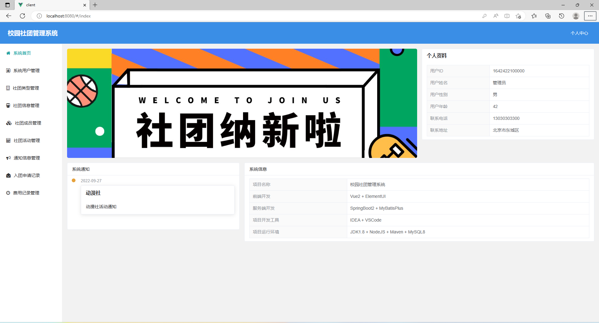
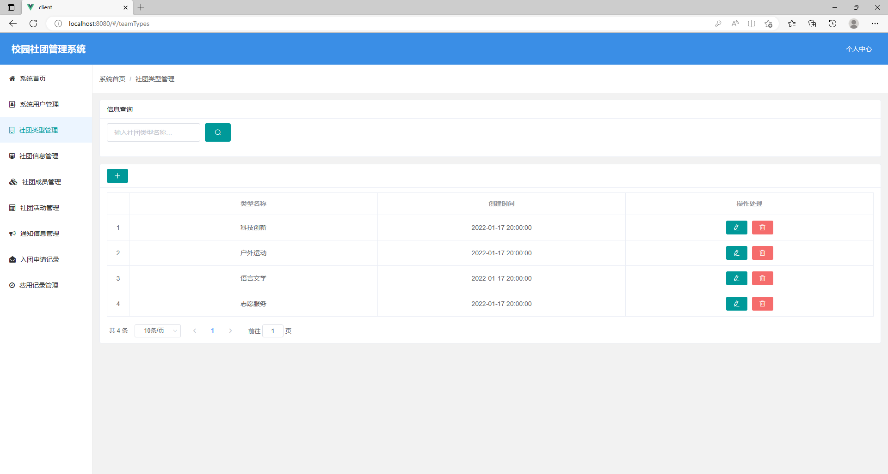
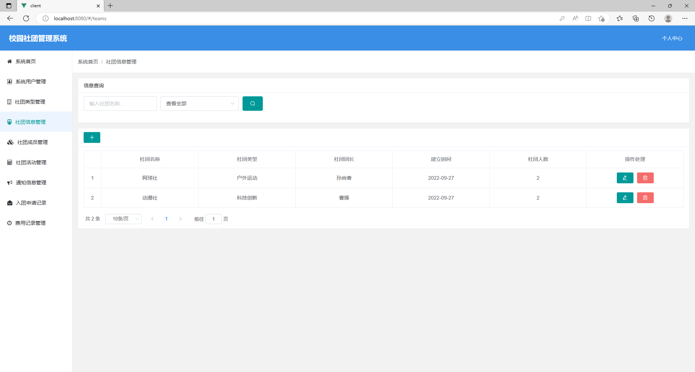
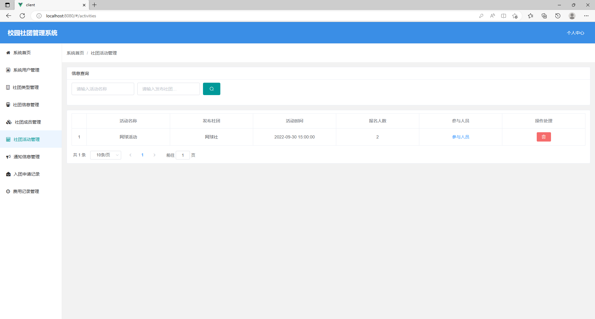
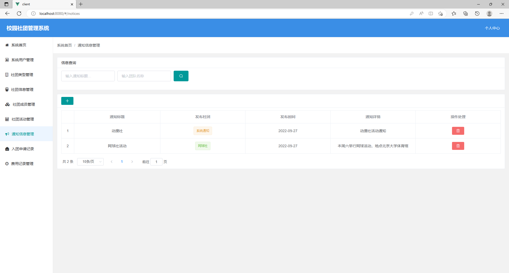
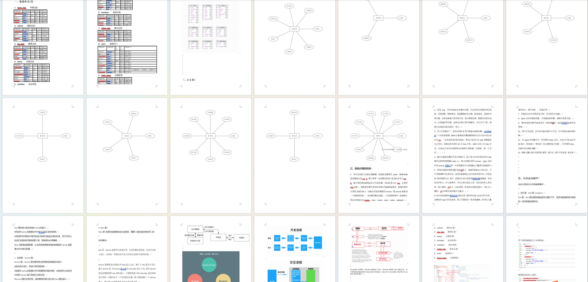

# 社团管理系统


## 一、项目介绍

运行环境:idea或eclipse vscode 数据库:mysql

开发语言：java

基于springboot+vue 的校园互助管理系统

基于springboot+vue的前后端分离社团管理系统

前端开发 : Vue2 + ElementUl

后端开发 : SpringBoot2 + MyBatisPlus

数据库 ：MySQL

设计思路

权限设计：系统管理员 社团管理员 普通用户

系统管理员：管理系统所有模块所有用户的，系统默认设置一个
社团团长：社团的负责人管理社团相关工作
普通用户： 我们个人可以申请账户，申请加入社团，看到社团相关信息

模块设计：

一、系统管理员：系统首页+系统用户管理+社团类型管理+社团信息管理+社团成员管理+社团活动管理+通知信息管理+入团申请记录+费用申请记录 9个模块

二、社团团长：系统首页+社团信息浏览+社团成员管理+入团申请记录+社团活动浏览+通知信息管理+费用申请记录 7个模块

三、普通用户： 系统首页+社团信息浏览+入团申请记录+社团活动浏览+费用申请记录 5个模块

用户身份users表
(0系统管理员，1社团团长，2普通用户)

[系统设计逻辑讲解]

系统管理员账户是初始化数据;
系统登录界面可以注册，注册完成后为普通用户，系统管理员可以管理系统所有模块;
社团团长功能介绍：如张三首次注册是普通用户，如果张三被设置为社团团长后，张三的系统身份会自动变为社团团长，社团团长有且只能加入管理此一个社团;社团团长可以管理自己负责社团信息；
普通用户功能介绍：如王五首次注册是普通用户，王五作为普通用户可以加入多个社团，可以看的多个社团的相关信息活动信息等
总结：首次注册均为普通用户，系统管理员设置某个用户为社团团长后，对应用户权限会更新，可以管理自己负责社团;

## 二、系统运行界面展示


### 部分功能界面截图











### 6000字项目文档参考



## 三、视频演示

```
链接：https://pan.baidu.com/s/1BtvCB8MGJaI_wVMvyRB-vg?pwd=dp23

提取码：dp23

--来自百度网盘超级会员V6的分享

```

## 四、 9.9￥ 获取完整源码+sql，附赠6000字论文参考，需要加Q：3808981644 备用Q：3577148218
## 有问题，或者需要协助调试运行项目的也可联系

